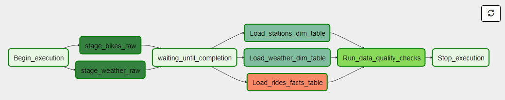
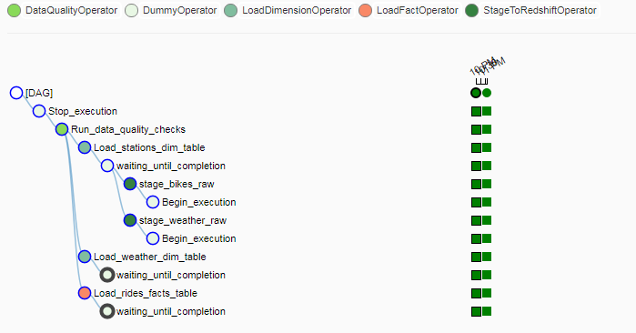
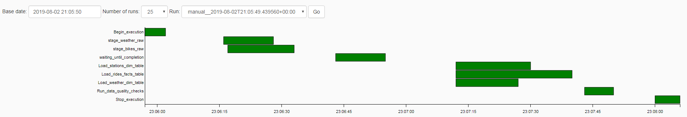

# Data Processing with Airflow
### Data Engineering Capstone Project 

#### Project Summary

The project follows the follow steps:
* Step 1: Scope the Project and Gather Data
* Step 2: Explore and Assess the Data
* Step 3: Define the Data Model
* Step 4: Run ETL to Model the Data
* Step 5: Complete Project Write Up

### Step 1: Scope the Project and Gather Data

#### Scope 
Explain what you plan to do in the project in more detail. What data do you use? What is your end solution look like? What tools did you use? etc>

The aim of the project is to process data from a S3 bucket in csv format into tables in Redshift. This tables could be useful for the operation team of the company that demands this system. Examples of case uses are defined in the appropriate section.

Technologies that are involved in this project are:
* Amazon S3: storage system from AWS.
* Airflow: orchestrator of ETL processes.
* Redshift: distributed SQL database from AWS.

#### Describe and Gather Data 
Describe the data sets you're using. Where did it come from? What type of information is included?

* Rides data: collected from rides in Capital Bikeshare System (Washington DC). Available in their [S3 bucket](https://s3.amazonaws.com/capitalbikeshare-data/index.html).
* Weather data: collected from meteo station at Reagan Airport (Washington DC). Provided by [NOAA](https://www.ncdc.noaa.gov/data-access/land-based-station-data/land-based-datasets).

### Step 2: Explore and Assess the Data
#### Explore the Data 

Data is provided in plain csv files. In order to ease ingestion and extract valuable data afterwards, two staging tables are crated only with type definition for each column.

#### Cleaning Steps
Document steps necessary to clean the data
* Rides table: since all fields come with double quote sign ("), it must be removed before processing. Afterwards, every fields is casted to the proper type: integers or timestamps.
* Weather table: every field is casted to the proper type: floats or timestamps.

### Step 3: Define the Data Model
#### 3.1 Conceptual Data Model
The aim of the whole pipeline is to provide the customer with three tables:
* Rides table: contains only start and end points id, start and end time of the rides and bike id.
* Stations table: contains a relation between stations id and names.
* Weather table: contains timestamp of measurement, wind speed, precipitation and visibility.

#### 3.2 Mapping Out Data Pipelines
Needed steps in the airflow pipline are provided in the next image:

 

### Step 4: Run Pipelines to Model the Data 
#### 4.1 Create the data model
 Tasks and relations among them are described in the next image:

 

Queries that defines the logic behind each task are contained in [helpers module](https://github.com/cokebdj/capstone_airflow/blob/master/plugins/helpers/sql_queries.py)

A chart that shows a Gant diagram of how and when tasks have been executed is provided in the next image:

 

#### 4.2 Data Quality Checks
Quality checks are included in the final task within the DAG. These checks are row counts in order to determine that there are no empty tables.

#### 4.3 Data dictionary 

* Rides table:
    * duration (int4): duration in secods of trip.
    * start_date (timsetamp): timestamp for ride start.
    * end_date (timsetamp): timestamp for ride end.
    * start_station_number (int4): station id for ride start.
    * end_station_number (int4): station id for ride end.
    * bike_number (varchar): id for bike.

* Stations table:
    * station_number (int4): station id.
    * station_name (varchar): station name.

* Weather table:
    * date (timsetamp): timestamp of measurement.
    * precipitation (numeric): last hour precipitation index.
    * visibility (numeric): current visibility index.
    * wind_speed (numeric): current wind speed in knots.

### Step 5: Complete Project Write Up

#### 5.1 Use cases
* Provisioning for stations: by analyzing how traffic varies for each station (peak and valley hours), dimension the amount of bikes per station in order to improve quality of service.
* Provisioning for public transport: by analyzing how traffic varies regarding weather condition it would be possible to share data with other public transportation systems in order to efficiently assign resources for crowded routes.
* Predictive maintenance: by analyzing the time a bike has been used, prevent failure before happening.

#### 5.2 Update frequency
Since data is updated monthly, a higher frequency could not be provided.

#### 5.3 Rationale

Airflow has been selected for this project since it provides an easy and flexible interface to manage pipelines. In case different frecuencies for updating data are required, with a single parameter it is posible to modify the whole process. 
